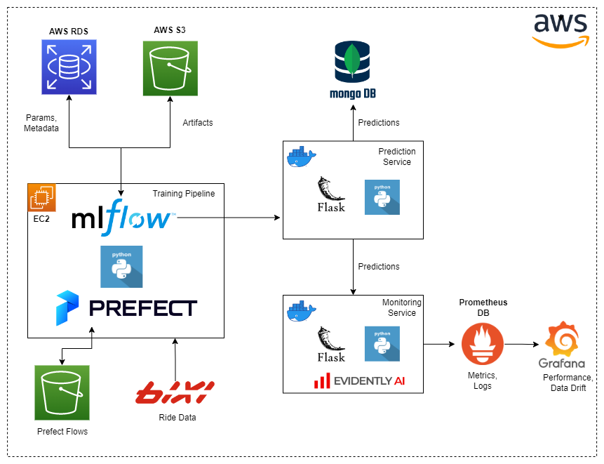

# Bixi Ride Duration Prediction Platform
MLOps project to predict ride duration using [Bixi bicycle ride data](https://bixi.com/en/open-data) of Montréal. This project is done as the capstone project of [MLOps Zoomcamp](https://github.com/DataTalksClub/mlops-zoomcamp) organized by [DataTalks.Club](https://datatalks.club/). 

# Project Overview

## Problem Definition
BIXI Montréal is a public bicycle sharing service operating in Montréal, Quebec, Canada. It started in 2009 and has become one of the largest bike-sharing systems in North America. In their BIXI application, they want to add a new feature that would give an estimation of the time needed for a ride given the start and the destination stations. This will help the users to make a better choice between the available transportation options. 

The BIXI application collects the data of different rides and the location data of stations. In the historical data, the duration of the rides already exists. The goal is to create an ML model to predict the duration of a ride using this historical ride data. 

## Proposed Solution
In this project, we propose a web service for BIXI that predicts the duration of a ride given the ride details. The BIXI application can call the endpoint of the web service with the ride details and show the prediction given by the service in the app. For developing the model, we collect the historical data available on the [Bixi Open Data](https://bixi.com/en/open-data) portal. They publish the data for the previous month at the beginning of each month. The service is containerized using Docker so that it can be easily deployed in the cloud and meet the scalability requirement of the application. 

Apart from the  model itself, we provide a training pipeline which is scheduled every month to train the model with the new data. The workflow is deployed in the cloud so that it is accessible and executable from a machine in local or cloud. This training pipeline registers the experiment metadata and the model in the cloud platform. The pipeline deployment and the execution detailes and logs can be visible from the cloud platform.

We also provide a real-time dashboard to monitor the model performance. The dashboard can detect drift in the features. The prediction model sends log to a data base. Further services such as reports could be developed on top of this data. 

To summrize, the proposed solution is composed of the following components. 

- A duration prediction service developed using Flask and containerized in Docker
- A model training pipeline in Prefect 2 deployed in AWS
- Model and metadata registry based on cloud deployment of MLFlow
- Realtime model performance monitoring dashboard using EvidentlyAI with capability of detecting data drift

## Tools and Technologies

**Programming Language:** Python. Flask for developing the Prediction and Monitoring services.

**Cloud Platform:** AWS. Used services are: AWS RDS, EC2, and S3. 

**Orchestration:** Prefect 2. Deployed in EC2 and stores the flows in the S3.

**Metadata and Model Registry:** MLFlow deployed in EC2. It uses AWS RDS (Postgres) for storing metadata and S3 for the artifacts. 

**Model Monitoring:** Evidently AI. Monitoring logs stored in Prometheus and dashboard is developed in Grafana.

**Containerization:** Docker

**Model Prediction Logs:** MongoDB


Overall architecture of the project is shown below.


# Running the Project

## AWS Resources
The project is built using AWS Cloud. To run the project, you need to have an AWS account and following resources there. 
- AWS RDS (PostgreSQL)
- AWS EC2
- AWS S3

You can choose the component versions which are free tier eligible. Still you might have a small cost.

## Configuring AWS and MLFlow
For the basic setup of the AWS and MLflow, you can follow this elaborative tutorial on [MLOps Zoomcamp repo](https://github.com/DataTalksClub/mlops-zoomcamp/blob/main/02-experiment-tracking/mlflow_on_aws.md). After the configuration, start the MLFlow server using the same command given in the last section of the tutorial.

## Configuring Prefect
### Prefect 2 Deployment in AWS
For the configuration of the **Prefect 2** (Prefect 2.2.0 is used in this project), you can follow the ***Remote Prefect Orion Deployment*** section and ***Defining Storage for Prefect*** section of this [tutorial](https://gist.github.com/Qfl3x/8dd69b8173f027b9468016c118f3b6a5#remote-prefect-orion-deployment). Start the server on the EC2 using the same command as showed in the tutorial.

### Dev Environment Setup for Prefect 2
In your machine from which you will be running the Training Pipeline, you need to configure the Prefect API. You can do this by running the following commands.

```shell
prefect config view # to see the current config 
prefect config unset PREFECT_ORION_UI_API_URL # unset if it is already set
prefect config set PREFECT_API_URL="http://<EC2 Public IPv4 DNS>:4200/api" # to set the config
```

### Environment Variables
For running the project, you need to set the following environment variables.

- **AWS_ACCESS_KEY_ID** - Access key of your AWS user
- **AWS_SECRET_ACCESS_KEY** - Secret access key of your AWS user
- **TRACKING_SERVER_HOST** - Your EC2 Public IPv4 DNS
- **AWS_S3_DIRECTORY** - For storing the prefect flows, in this format: <S3 BUCKET/FOLDER>
- **RUN_ID** - Run Id of the ML flow experiment, run the Training Pipeline for creating some runs
- **EXPERIMENT_ID** - Id of the MLFlow experiment
- **S3_BUCKET_NAME** - Name of the S3 bucket where the artifacts are stored

## Runtime Environment Setup
To setup the runtime environment, you could install the requirements given in the `requirements_global.txt` file using Pip. To isolate the dependencies of this project from other prjects, it is preferable to create a separate virtual environment. You may use Anaconda or Pipenv for this purpose. 


## Building the Containers
To build the containers, you need to have Docker installed. For the installation of Docker, you can follow this [tutorial](https://www.youtube.com/watch?v=IXSiYkP23zo&list=PL3MmuxUbc_hIUISrluw_A7wDSmfOhErJK&index=3&t=400s). To build the containers, move to the  `src` directory and run the following command.

```shell
docker compose up --build
```
This will build and start the containers. Grafana dashboard will be available at the port `3000` and Prometheus will be availavble at `9091`.  To stop the containers press `CTRL+C`. To remove the containers you can run the following command. 

```shell
docker kill $(docker ps -q)
```

**NOTE**: To build the container, the environment variables has to be set as discussed in the previous section. There are two python files in  the src directory. 
- *prepare_monitoring.py* - Run this file to create the reference data (bixi_monitoring_06_22.csv) for the monitoring service. This data need to be generated (if not exists) before building docker containers

- **send_data_monitoring.py** - Run this file to send some request to the prediction service and hence populate the dashboard

## Running the Training Pipeline
For running the training pipeline, activate the runtime environment. The environment variables (TRACKING_SERVER_HOST, AWS_ACCESS_KEY_ID, AWS_SECRET_ACCESS_KEY, S3_BUCKET_NAME) need to be set as discussed in the previous section. You can run the `training_orchestrator.py` file from `training_pipeline` folder. This will create deploy the flow that will run at the 5th of every month. To run the flow immediately, you need to uncomment `main_training_flow()` line. Run the `setup_prefect_storage.py` before to setup the storage.